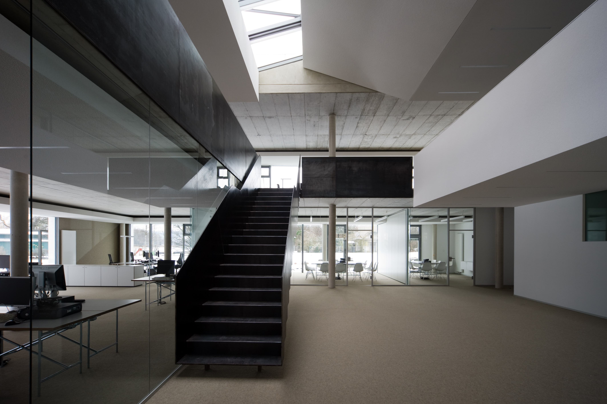

 

<strong>This is the Client-App for the Seitenbau Bauplan</strong>

Created by <a href="https://twitter.com/teddy_lukas">Lukas Ochmman (SEITENBAU) </a>With the <a href="https://github.com/orgs/react-boilerplate">React-Boilerplate</a>from <a href="https://twitter.com/mxstbr">Max Stoiber</a> and maintained with ❤️ by an amazing <a href="https://github.com/orgs/react-boilerplate/teams/core">team of developers</a>.

## Features

None

## License

This project is licensed under the MIT license, Copyright (c) 2017 Maximilian
Stoiber. For more information see `LICENSE.md`.
